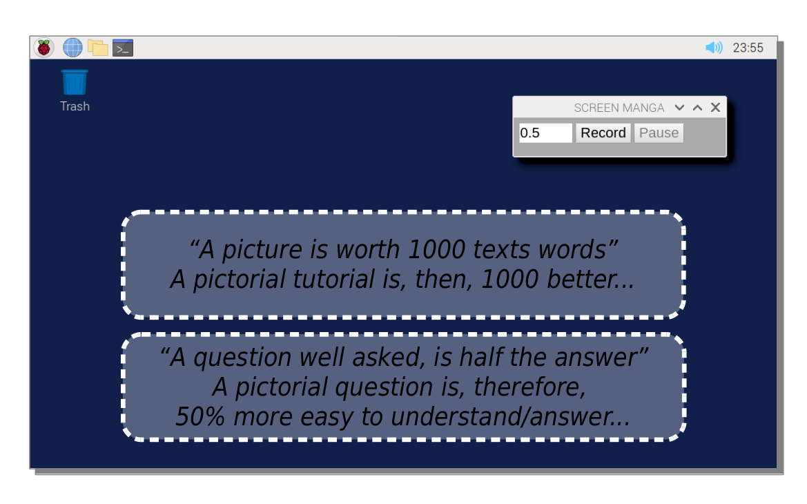
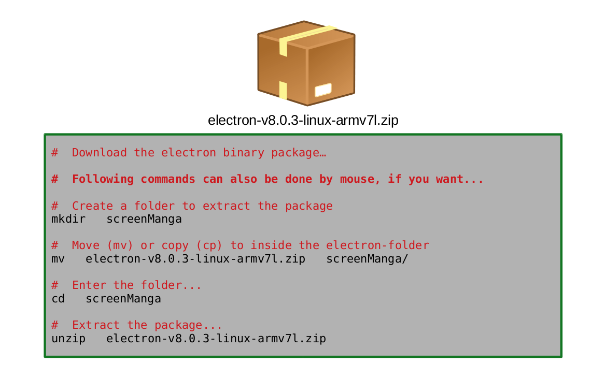
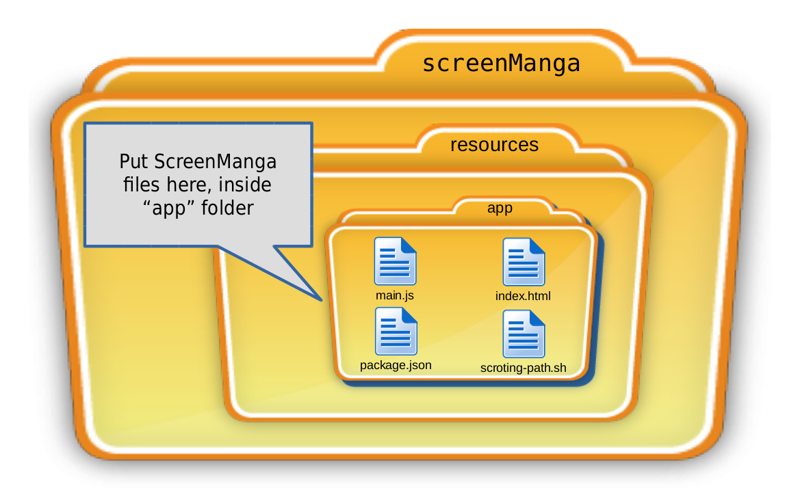

# wl-screen-mangaGUI
GUI version of Screen-Manga Screenshot Sequence
  
  
**Visual Tutorial HowTo**  
  

  
---

  
---

  
---

  
---

  
---

  
---

  
---

  
---

  
---

  
  
---
  
**HOWTO in Screenshot Sequence**  
Take look inside folder ANIME-HOWTO, for a screenshot sequence in anime style...  
  
  
 .
